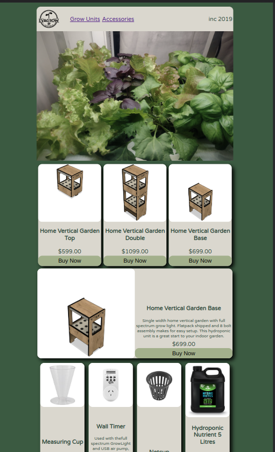

# 01 Project - Online Shop

## Products

The online webstore is designed to sell indoor, kitset hydroponic units and accessories. The units are flat pack shipped and assembled by the customer. This is a design I made in 2020 that never progressed further than prototypes.

I thought it would be a good exercise to explore.

## Dependencies

Full application uses Stripe and Render.
A Stripe passthrough backend is hosted on Render.com as a Web Service.
This hosts the API keys required to access the products in the Stripe Database.

### Deployment

Deploy the backend application 'React Online Shop Passthrough' with:

Environmental Variables
REDIRECT_TO: 'http://localhost:3000'
STRIP_SECRETE_KEY: 'API_KEY_FROM_STRIPE'

Link the front-end application to the Github repo and set the below settings

Root Directory: ''
Build Command: 'npm run build'
Publish Directory: 'build'

## App Components

### Accessories

This component takes the products json from the Stripe API, checks its metadata to see if its product type is 'Accessory'. It then maps through the array creating "accessory" cards.

This component wont render until useEffect loadData has been fulfilled.

### GrowUnits

This component takes the products jason from the Stripe API, and checks its metadata to see if its product type is 'unit'.
It then maps through the array creating "unit" cards.

This component wont render until the useEffect loadData has been fulfilled.

The function changeDisplayUnit is passed down into the GrowUnits component to collect an onclick event from the div element. This is to change the state in the HeroUnits Component.

### Hero

This is a simple Hero component that cycles through an array of images and displays them at the top of the page.

### HeroUnit

This component takes the state from setMainUnit and displays it with the units description.

When a unit card is selected (but not on the buy now button) this components state is updated through the changeDisplayUnit function.

### Loading

Loading component plays a simple GIF while the pages is waiting for a response from the Stripe API. I added this after I couldn't tell if my app was broken or if it was just slow.

### Navbar

Simple navbar that contains the company logo and a scroll too link for the Grow units and Accessories.

## LIVE APPLICATION

Live Application can be found:
https://react-clientside-project.onrender.com
